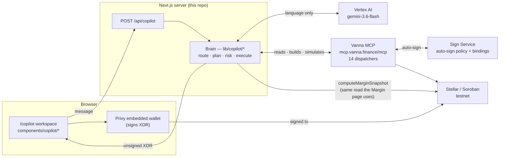
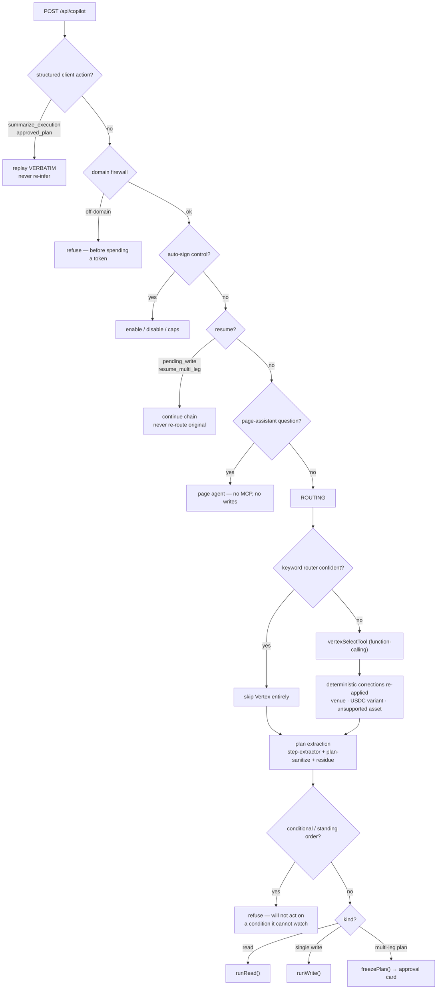
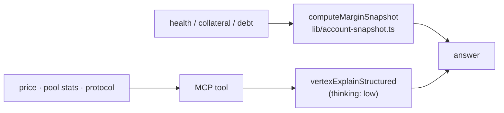
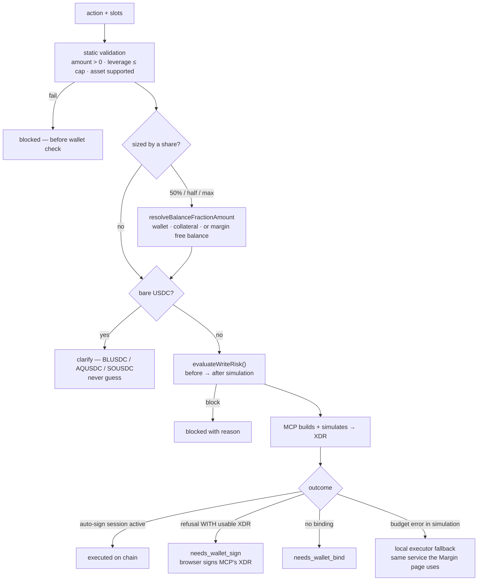
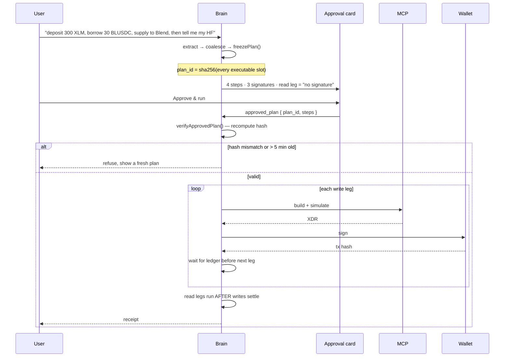
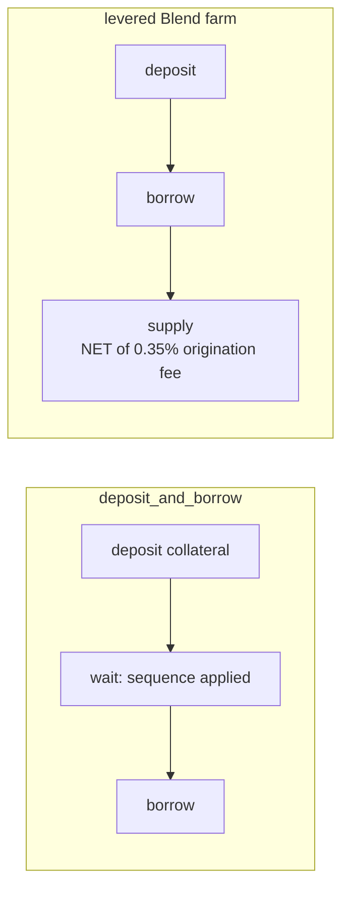
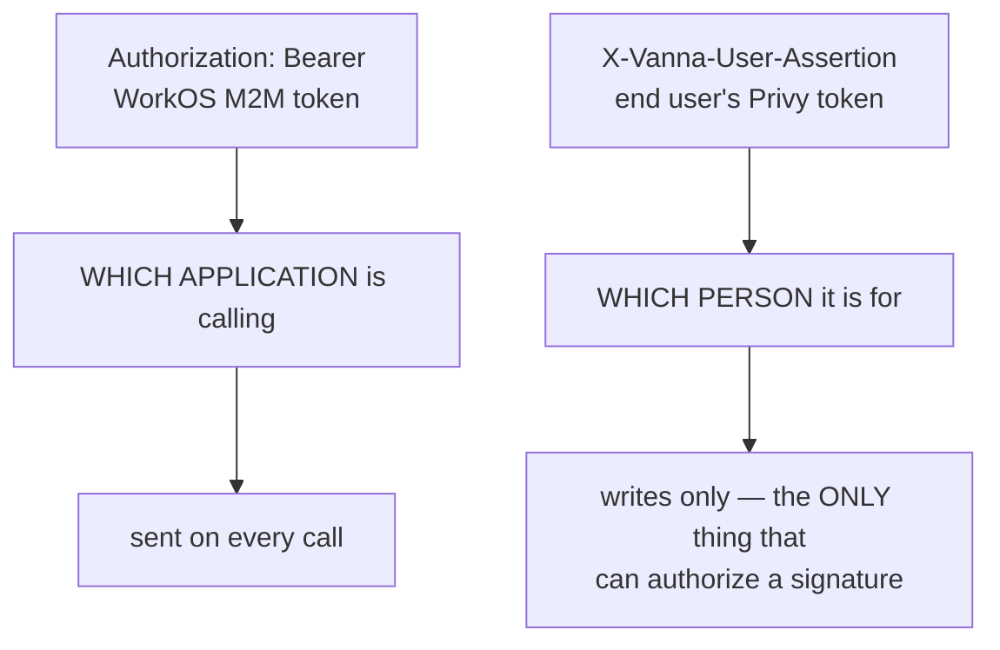

# Vanna Copilot — architecture

Diagrams for the whole system: services, the path a message takes, the write and plan
lifecycles, identity, and multi-leg execution.

Read with:
- [README.md](./README.md) — prose reference for the same system
- [GUARDRAILS.md](./GUARDRAILS.md) — every refusal and safety gate, and where it lives
- [ONBOARDING.md](./ONBOARDING.md) — run it in ~15 minutes

> **Stale-doc warning.** `docs/ONBOARDING_COPILOT.md` and `docs/copilot-integration-plan.md`
> describe a **FastAPI Python orchestrator** (`app/orchestrator/pipeline.py`, `app/mcp/`).
> That service does not exist in this repo. The brain is **in-process TypeScript** under
> `lib/copilot/` (38 modules). Do not hand those two files to a new developer.

---

## 1. Services

Four processes. Only the browser ever holds a signing key.



**The load-bearing rule:** Vertex only ever interprets *language*. Amounts, assets,
ordering, refusals and execution are deterministic code. Every bug that looked like "the
model said something plausible and wrong" came from bending this.

---

## 2. The path a message takes

`lib/copilot/handle.ts` → `handleChat()`. Order is deliberate; several branches exist
specifically to run *before* something more expensive or less safe.



### Why the order matters

| Step | Runs before | Because |
|---|---|---|
| `approved_plan` replay | routing | Re-running the model could produce a *different* plan than the user approved |
| Domain firewall | Vertex | Off-domain prompts must not cost a token |
| Resume | routing | Re-routing the original prompt would re-execute legs already on chain |
| Amount/leverage validation | wallet check | Otherwise `-5 USDC` answers "connect your wallet", hiding the real problem |

---

## 3. Reads

Position questions bypass MCP on purpose.



`computeMarginSnapshot` is **the same on-chain read the Margin page renders**. This is an
override, not a fallback: MCP reports only the recorded balance while the site also
reconciles raw SAC holdings. They disagreed — $214.72 vs $382.87 of collateral, HF 1.95 vs
3.47. Two different answers to "am I about to be liquidated" is the worst failure this
surface has.

---

## 4. A single write



**A refusal to auto-sign is not a failed transaction.** If MCP built a usable XDR, the leg
is staged for the wallet. Getting this wrong is what made account creation fail whenever
auto-approve was off — the built XDR was discarded and an error reported instead.

---

## 5. Plan lifecycle — freeze, fingerprint, replay



Two properties this buys:

1. **What executes is what was approved.** The fingerprint covers *every* executable slot,
   derived by iterating `EXECUTABLE_SLOTS` — not a hand-picked list. Hand-picking is how
   `leverage`, then `borrow_asset`, then `token_out` each fell outside the hash. An
   approved "deposit 500 AQUSDC, borrow XLM at 3×" once replayed as `borrow 1000 AQUSDC`.
2. **Read legs are first-class.** "…then tell me my health factor" is shown as a
   non-signing row, excluded from the signature count, included in the fingerprint, and run
   **after** the writes settle. A report on pre-action state answers the wrong question.

---

## 6. Multi-leg execution

Ops that cannot be atomic are split, with the protocol reason recorded next to the rule in
`registry/workflows.ts`.



- `deposit_and_borrow` is split because MCP's combined call runs `is_borrow_allowed`
  against collateral *before* the deposit leg of the same call is credited.
- The farm supply leg uses the **net** borrow, not the gross — you can only supply what you
  actually received.
- Between legs the executor waits for the source account's sequence to be *applied* on
  Horizon. Skipping this produced `txBadSeq` on hop 2.
- Exactly one leg is settled per signature (`claimFirstAwaitingLeg`). Stamping every
  matching leg with one hash once marked legs 3 and 4 "done" against leg 2's transaction —
  claiming transactions that never happened.

---

## 7. Identity — two headers, never conflated



And three separate permissions that look alike and are not:

| # | Thing | Where it lives | Reconnecting the wallet fixes it? |
|---|---|---|---|
| 1 | Wallet **connected** | Browser / Privy session | — |
| 2 | Vanna is a **bound signer** | Row in the Sign Service (`addSigners` quorum) | **No** — needs explicit consent, once per wallet |
| 3 | Auto-sign **session** | Sign Service policy, with spend caps | No — separate from (2) |

`disable auto-sign` revokes (3) only: *"Privy addSigners was NOT removed."* So the bind is a
one-time step per wallet, not per session.

---

## 8. Repositories

| What | Path | Notes |
|---|---|---|
| Website + copilot | this repo | Next 16, Turbopack. Brain in `lib/copilot/` |
| MCP server (Python) | `../vanna_mcp` | git root is `vanna_mcp`; code in `vanna_mcp/vanna-mcp/` |
| Sign Service (Node/TS) | `vanna_mcp/vanna-mcp/sign-service/` | **not** the standalone `Documents/vanna-sign-service` |

---

## 9. Observability

`COPILOT_LOG=1` gives one line per turn plus one per model call:

```
[copilot:vertex] answer prompt=906 cached=0 (0%) output=48 thoughts=112
[copilot] {"event":"turn","template_id":"query_price","execution":null,...}
```

`thoughts=` explains cost and latency — thinking bills at output rates. The turn line's
`privy_token_present` / `bound_kind` / `signed_in` answer "which hop dropped the user
identity" without guessing from a symptom three services away.

**Measured warm latency (2026-08-10):** read 6.7s · 2-step plan 7.4s · 4-step plan 6.5s.
Never measure the first request after an edit — that is Turbopack recompiling, and it reads
9–60s regardless.
