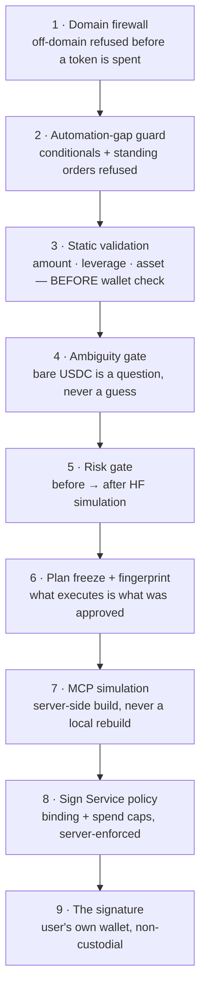
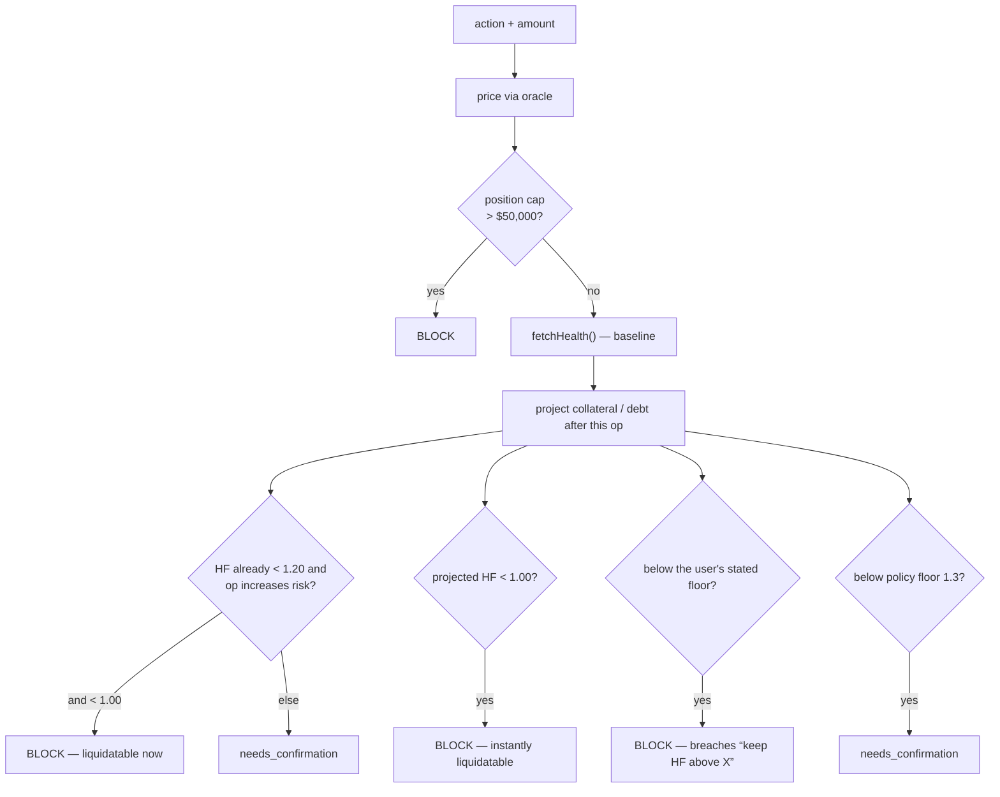

# Vanna Copilot — guardrails

Every safety property: what it refuses, which file owns it, and the failure that motivated
it. Read with [ARCHITECTURE.md](./ARCHITECTURE.md) for where each sits in the flow.

**The rule everything else follows from:** the LLM interprets *language*. It never decides
what is safe, never invents a number, and never chooses whether something executes.
Deterministic code owns amounts, assets, ordering and refusals; MCP and the Sign Service own
risk and spend policy.

Practical consequence: **prompt injection cannot move funds.** A prompt can influence which
*words* the model returns, but the amount, the asset, the venue, the risk decision and the
signature are all decided by code the model does not touch.

---

## 1. Defence in depth — the layers in order



Layers 1–6 are this repo. 7–8 are MCP / Sign Service. 9 is the browser. **No layer trusts
the one above it.**

---

## 2. Refusals — what the copilot will not do

| Refusal | Owner | Trigger | Why |
|---|---|---|---|
| **Off-domain** | `domain-firewall.ts` | Anything outside product vocabulary | Refuse before spending a token. Allowlist spells out every inflection — `position\b` does not match "positions" |
| **Conditional** | `conditional-guard.ts` | "if my HF is above 2, borrow 5" | It cannot evaluate the condition, so acting on it would be acting on a clause it never read |
| **Standing order** | `conditional-guard.ts` | "keep an eye on my position and pull collateral if it gets risky" | Nothing here watches continuously; accepting would imply monitoring that does not exist |
| **Liquidate** | `router.ts` | "liquidate …" | Returns `restricted` **before any tool call** |
| **Unsupported asset** | `router.ts` + `registry/assets.ts` | "supply 20 DOGE", "XLM/BTC pool" | Refuses with the supported set, rather than failing after amounts are collected |
| **Bare USDC on a write** | `mcp-write.ts` | asset is exactly `USDC` | Three separate SACs; picking one is unrecoverable |
| **BLUSDC swap** | `mcp-write.ts` | "swap XLM to BLUSDC" | Neither DEX trades Blend USDC — the only way to "fill" it is a different token |
| **Leverage over cap** | `handle.ts` | `> maxLeverage` (10) | Named up front rather than after a round-trip that would be refused anyway |
| **Partial LP removal** | `mcp-write.ts` | "remove half my liquidity" | The protocol removes a specific LP amount or the whole position — a fraction is not a shape it accepts |

---

## 3. Risk gate — `lib/copilot/risk.ts`

Runs on every margin-affecting write. Pure code; cannot be bypassed by prompt injection.



Decisions: `allow` · `needs_confirmation` · `block`.

**A user-stated floor blocks; it never sizes.** "Keep me above 1.4" asks not to be
liquidated — it is not a request to be taken to the edge of 1.4. Size comes from a stated
amount or multiple; if neither is given, the copilot asks.

**The baseline is never silently zero.** `fetchHealth` falls back to `computeMarginSnapshot`
when the health tool cannot answer. This matters because **MCP reports a Soroban budget
overrun as HTTP 200 carrying an error field** — it never rejects — so a `try/catch` is the
wrong guard on its own. Before the fallback existed, a failed read became `collateral: 0`,
indistinguishable from an empty account, and produced "debt goes from $0.00 to $2.00 … you
would be at or past the liquidation point" for a wallet holding $383 of collateral. A false
liquidation warning is worse than no projection.

### Config

| Setting | Default | Enforced by |
|---|---|---|
| `MIN_HEALTH_FACTOR` | 1.3 | Copilot risk gate (advisory floor) |
| `MAX_LEVERAGE` | 10 | Copilot pre-flight |
| `MAX_POSITION_USD` | 50,000 | Copilot risk gate |
| `COPILOT_MULTI_LEG_MAX` | 8 (1–12) | Caps latency and blast radius per turn |
| `COPILOT_READS_ONLY` | false | Kill switch — disables all writes |
| Spend caps | server default ≈ $1000/tx, $1000/day | **Sign Service** (the authority) |

The local risk vars are the copilot's own conservatism. **HF, leverage and spend caps are
ultimately enforced by MCP and the Sign Service** — the copilot refusing early is a
courtesy, not the boundary.

---

## 4. Integrity of an approved plan

`plan-approval.ts`. Three properties:

1. **Freeze** — the plan is built once, annotated, and returned. Nothing executes.
2. **Fingerprint** — `plan_id` is a hash over *every* executable slot, derived by iterating
   `EXECUTABLE_SLOTS`. Hand-listing fields is how `leverage`, then `borrow_asset`, then
   `token_out` each fell outside the hash.
3. **Replay** — approval skips routing entirely. `verifyApprovedPlan()` **rejects rather
   than repairs**: a mismatched hash or a plan older than 5 minutes is shown again, not
   fixed silently.

> The hole this closes, concretely: an approved *"deposit 500 AQUSDC, borrow XLM at 3×"*
> once replayed with `borrow_asset` empty and executed as `borrow 1000 AQUSDC` — the dollar
> value of the debt spent as collateral tokens. A different trade from the one approved.

Plans expire after 5 minutes because they are built on live prices and health.

---

## 5. Truthfulness guardrails

Not safety in the "lost funds" sense — safety in the "the user believed something false"
sense. These have caused as many real problems.

| Rule | Where | The failure it prevents |
|---|---|---|
| **Labels are built from the wire symbol, never the user's word** | `mcp-write.ts` | A card read "Swap 10 XLM → BLUSDC" over a transaction buying **AQUSDC** |
| **Never claim a transaction that did not happen** | `copilot-workspace.tsx` | One signature once marked legs 3 and 4 "done" with leg 2's hash |
| **A read-only plan reports `answer`, never `executed`** | `handle.ts` | Three reads once returned "All strategy steps finished" having changed nothing |
| **Never quote a figure from a guessed price** | `leverage-plan.ts`, `handle.ts` | Inventing 1.0 for XLM would size a borrow ~11× too large |
| **Never narrate a zeroed baseline** | `risk.ts`, `handle.ts` | See the false liquidation warning above |
| **`_human` fields only** | `explain.ts` | Raw 18-decimal wads shown beside their formatted twin read as the copilot disagreeing with itself |
| **One source for positions** | `account-snapshot.ts` | Copilot and Margin page disagreeing about the same account |

---

## 6. Non-custodial by construction

- The brain **never holds a key and never signs**. A full server compromise cannot move a
  token.
- Writes return either an MCP-built XDR for the browser to sign, or a server-side auto-sign
  that the **Sign Service** authorised against its own policy.
- The browser signs the XDR **MCP built** — it does not rebuild locally. Rebuilding produced
  bogus "XLM not set in the Registry" errors, and a locally-built envelope is one MCP never
  simulated.
- Vanna's quorum is added *alongside* the user's own key (`addSigners`). Custody stays with
  the user, revocable in Privy at any time.

### The one thing to know before testing

**With auto-sign enabled, a single-leg write executes immediately — no preview, no approval
click.** `plan_preview` only guards multi-step plans. Before running any write matrix, set
`COPILOT_READS_ONLY=true`, or use a wallet with auto-sign off, or exclude write rows. Never
put `settle_account` / `close_account` in an automated prompt list against a real account.

---

## 7. Verifying a guardrail still holds

Deterministic — no wallet, no chain:

```bash
npx vitest run                 # 778 tests
npx tsc --noEmit
```

Guardrail-specific suites:

| Suite | Covers |
|---|---|
| `tests/lib/plan-read-legs.test.ts` | Read legs survive freeze → approve → replay |
| `tests/lib/leveraged-plan-path.test.ts` | Merge is narrow; an explicit borrow size is never overwritten |
| `tests/lib/leveraged-cross-asset.test.ts` | All 16 collateral→loan pairs; oracle conversion both directions |
| `tests/lib/swap-usdc-variant.test.ts` | A named variant is honoured, never substituted |
| `tests/lib/balance-fraction.test.ts` | "max yield" never becomes "100% of my wallet" |
| `tests/lib/auto-sign-refusal-stages.test.ts` | A refusal with a usable XDR stages; a real simulation failure does not |
| `tests/lib/remove-liquidity-args.test.ts` | Only arguments MCP accepts are sent |
| `tests/lib/intent-contract.test.ts` | Every executable slot survives the approve round-trip |

Live regression prompts are in [NEXT-SESSION.md](./NEXT-SESSION.md) §3 — run both auto-sign
states.
