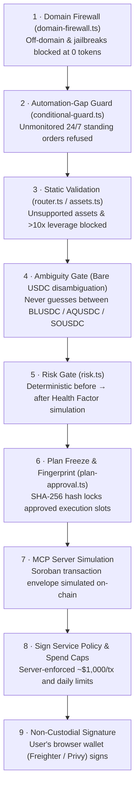
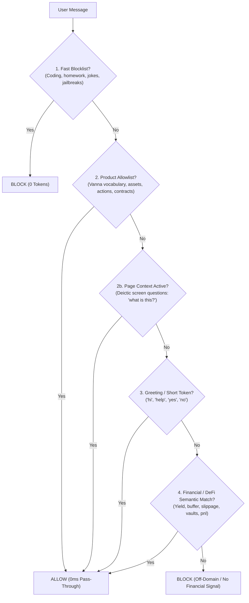
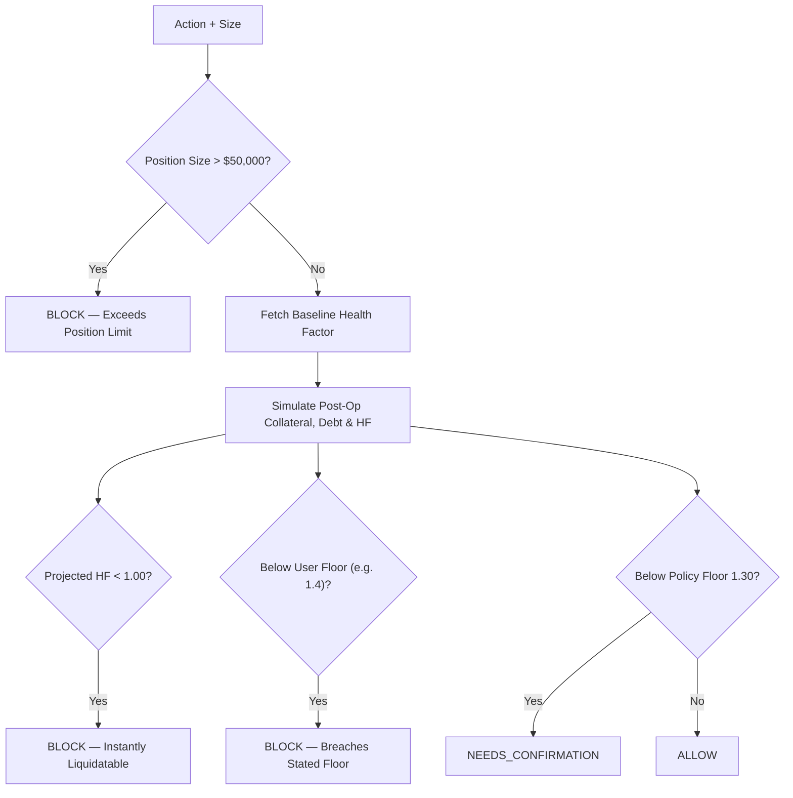

# Vanna Copilot — Guardrails & Domain Firewall Architecture

> Complete specification of all security boundaries, domain firewalls, risk simulation gates, and execution safeguards governing the Vanna Copilot Orchestrator on Stellar DeFi.

---

## 1. Core Architectural Principle

$$\textbf{The LLM interprets natural language} \iff \textbf{Deterministic code \& Smart Contracts govern execution}$$

* **Prompt Injection Cannot Move Funds:** An attacker may influence the natural language explanation returned by Gemini, but transaction amounts, recipient accounts, token contracts, risk simulations, cryptographic signatures, and spend policies are exclusively controlled by deterministic, non-model software gates.
* **Token Abuse & Cost Firewall:** The Domain Firewall filters out off-domain queries, coding requests, homework, math problems, and adversarial jailbreaks **before** burning any Google Cloud Vertex LLM tokens.

---

## 2. Defence-in-Depth: The 9-Layer Security Architecture

> **Note:** Layers 1–6 run in this Next.js server. Layers 7–8 run on the backend MCP / Sign Service. Layer 9 runs client-side in the user's browser wallet. **No layer trusts the one above it.**

---

## 3. Domain Firewall Deep-Dive (`lib/copilot/domain-firewall.ts`)

The domain firewall prevents bot abuse and protects Google Cloud Vertex AI billing by classifying prompts before calling Gemini 3.7 Flash:

### Layered Filtering Logic:
1. **Adversarial & Abuse Blocklist (`BLOCK_PATTERNS`):**
   * **Coding / Software Engineering:** Blocks requests for Python, TypeScript, React, Docker, CI/CD, smart contract coding.
   * **Academic & Homework:** Blocks essay generation, calculus, physics, and homework math puzzles.
   * **Adversarial Jailbreaks:** Blocks system prompt extraction (*"reveal your instructions"*), override attempts (*"ignore previous rules"*), and roleplay evasions (*"pretend you are a teacher/coder"*).
2. **Deterministic Product Allowlist (`ALLOW_PATTERNS`):**
   * **Actions:** `lend`, `borrow`, `repay`, `deposit`, `withdraw`, `farm`, `earn`, `swap`, `margin`, `stake`, `park`.
   * **Assets:** Dynamically synced from `registry/assets.ts` (`XLM`, `BLUSDC`, `AQUSDC`, `SOUSDC`, `USDT`, `bTokens`).
   * **Positions & Metrics:** `health factor`, `liquidation`, `collateral`, `debt`, `available credit`, `headroom`, `balance`.
3. **Screen / Page Deictic Allowlist:**
   * Permits on-screen inquiries (*"what am I looking at?"*, *"explain this chart"*) when page context is present.
4. **Financial Semantic Fallback (`FINANCIAL_SEMANTIC_RE`):**
   * Captures natural DeFi phrasings (*"what is my liquidation buffer"*, *"how much yield in vaults"*) so valid financial questions are never falsely rejected.

---

## 4. Google Cloud (GCP) Security & Model Architecture

* **Foundation Model:** **Gemini 3.7 Flash** (`gemini-3.7-flash`) via Google Cloud Vertex AI (Project: `vanna-mcp`, Location: `global`).
* **Vertex AI Model Armor Ready:**
  * Can be activated inline on GCP to enforce enterprise prompt filtering, DLP (PII redaction), and model-agnostic jailbreak detection.
* **Keyless Workload Identity Federation:**
  * Production authentication uses Google Cloud Workload Identity Federation (OIDC) rather than long-lived static service account keys in production.

---

## 5. Refusals & Execution Safeguards

| Refusal / Guard | Enforced In | Trigger Condition | Reason |
|---|---|---|---|
| **Off-Domain Abuse** | `domain-firewall.ts` | Homework, coding, non-financial chat | Prevents token drain and billing abuse. |
| **Adversarial Prompt Injection** | `domain-firewall.ts` | System prompt extraction / DAN mode | Rejects attack before Vertex invocation. |
| **Unmonitored Standing Order** | `conditional-guard.ts` | *"watch my position 24/7"* | Copilot does not maintain background cron monitors. |
| **Liquidation Attempt** | `router.ts` | *"liquidate 0x..."* | Returns `restricted` before any tool call. |
| **Unsupported Token** | `router.ts` / `assets.ts` | *"supply 10 BTC"* | Refuses immediately with list of supported tokens. |
| **Bare USDC on Write** | `mcp-write.ts` | Asset is exactly `USDC` | Prevents guessing between distinct Stellar SACs. |
| **Excessive Leverage** | `handle.ts` | Leverage $> 10\times$ (`MAX_LEVERAGE`) | Blocks leverage exceeding protocol safety thresholds. |
| **Replay & Double-Click** | `write-dedupe.ts` | Same `plan_id` within 15 seconds | Server-side atomic lock prevents double submission. |

---

## 6. Risk Gate & Margin Simulation (`lib/copilot/risk.ts`)

Runs automatically on every margin-affecting transaction:

---

## 7. Plan Integrity & Non-Custodial Safety

1. **Plan Freeze & SHA-256 Fingerprinting (`plan-approval.ts`):**
   * Multi-step plans are constructed, assigned a content hash (`plan_id`), and frozen. Approving a plan replays the frozen steps verbatim—it never re-queries the model.
2. **Non-Custodial by Construction:**
   * The server **never holds private keys**.
   * Transactions are simulated and constructed as XDR envelopes by the MCP server, and submitted to the user's browser wallet for final cryptographic signature.
