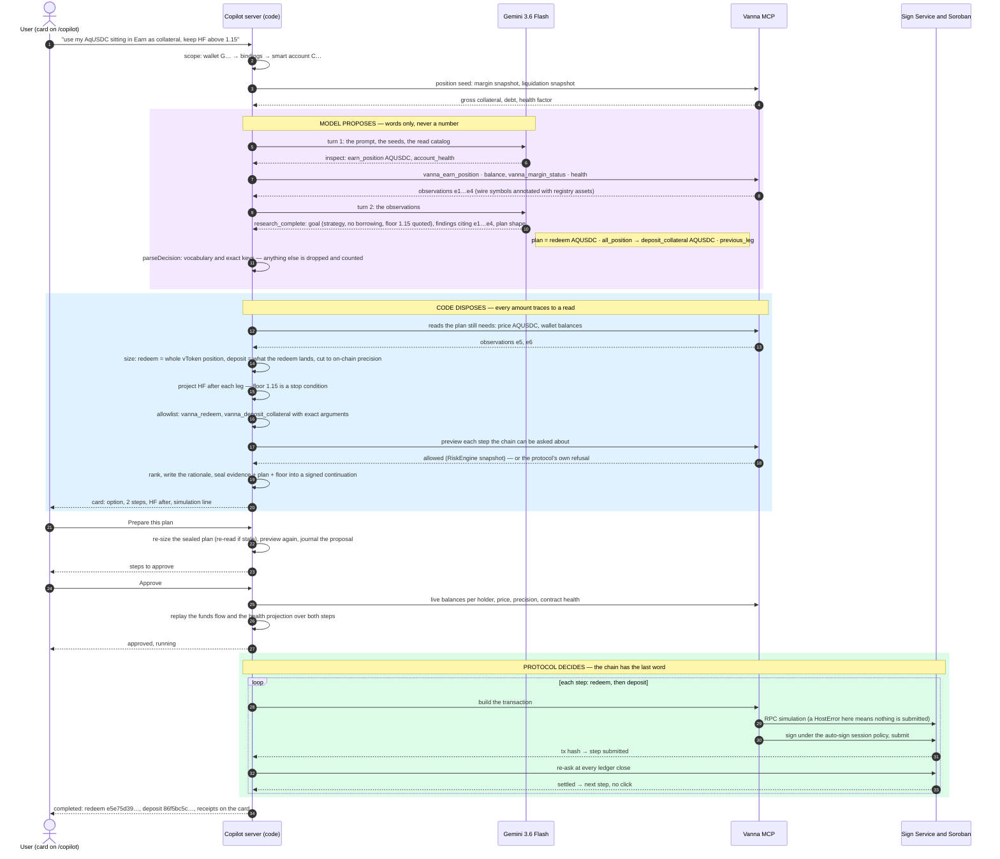

# The copilot lifecycle — one successful prompt, end to end

The run this follows is real (13 Sep 2026, signed-in `/copilot`, testnet, local MCP loop):

> **"use my AqUSDC sitting in Earn as collateral, keep HF above 1.15"**
> → redeem `e5e75d39…` settled → deposit `86f5bc5c…` settled, no click in between.

One rule: **the model proposes, the code disposes, the protocol decides.** Read top to bottom;
each column is who; each line is one hand-off. The shaded bands are the three phases.

## The exits, in the same order

| Instead of step | When | What the user sees |
|---|---|---|
| 10 | the model cannot tell what was meant (`clarify`) | one question, nothing else |
| 14–15 | a leg does not fit the reads, or would breach the floor | "Ruled out — …" with the figure (e.g. *only 59.5 XLM is spendable in the wallet*) |
| 18 | the RiskEngine preview says no | the option is removed, with the protocol's own sentence |
| 22 | the sealed plan no longer sizes on fresh reads | 409 with the reason — start a new investigation |
| 26 | live state fails the replay | back to proposed, nothing submitted |
| 29 | the RPC simulation refuses | "Not submitted — the protocol rejected this step", the run stops |

## What the model decides — and what it cannot

It decides **which reads** to make (step 6), **what the user meant** — intent, borrowing
permission, the floor, always anchored to the user's own words — and the **shape** of a plan:
ops from `WORKFLOW_OPS`, assets from the registry, sizing words from `PLAN_SIZINGS` (step 10).
It cannot choose an amount, a tool argument, a venue spelling or a rate. Everything from step 11
on would produce the same card if the model's JSON were typed by hand.

## Where it lives

| Steps | Files |
|---|---|
| 1–4 | `hooks/use-investigation.ts`, `app/api/copilot/investigate/route.ts`, `investigation/scope.ts`, `capacity.ts` |
| 5–11 | `investigation/flash.ts` (prompt), `decls.ts` (schema), `runtime.ts` (loop), `capabilities.ts` (reads), `decision.ts` (parser) |
| 12–20 | `strategy-reads.ts`, `plan.ts`, `sizing.ts`, `workflow/types.ts` (`OP_FLOW`), `workflow/allowlist.ts`, `simulate.ts`, `candidates.ts`, `answer.ts`, `continuation.ts` |
| 21–27 | `proposal.ts`, `workflow/risk.ts`, `workflow/journal.ts` |
| 28–34 | `execute.ts`, `hooks/use-workflow.ts`, MCP `vanna_earn_write`, `vanna_margin_trade`, `vanna_sign` |
