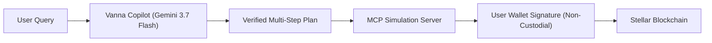

# Vanna Copilot — Onboarding Guide

> **Welcome to Vanna Copilot!**
> This guide is written for **both developers and non-technical team members** to quickly understand how the Copilot works, how to run it locally, how to test it, and how safety is guaranteed.

---

## 1. High-Level Overview (What is Vanna Copilot?)

Vanna Copilot is an **intelligent, non-custodial DeFi assistant and orchestrator** built for the Stellar blockchain.

### What it does:
1. **Answers DeFi Questions:** Explains on-screen charts, balances, lending pool APYs, collateral ratios, and Health Factors.
2. **Plans Multi-Step Strategies:** Understands natural language requests like:
   > *"Park 20 XLM then farm 10 BLUSDC at 2x leverage keeping my Health Factor above 1.4"*
   and converts them into exact, verified on-chain transactions.
3. **Guarantees Fund Safety:** The AI **never** touches private keys. You review and sign every transaction in your own wallet (Freighter or Privy embedded wallet).



---

## 2. Quick Start: How to Run Locally

### Prerequisites
* **Node.js** (v20+ recommended)
* **Git** and **npm**

### Step-by-Step Commands:

#### 1. Clone & Install Dependencies
```bash
git clone <repository-url>
cd vanna-copilot-orchestrator
npm install
```

#### 2. Configure Environment Variables
Create a file named `.env.local` in the project root:
```env
LLM_PROVIDER=vertex
GOOGLE_CLOUD_PROJECT=vanna-mcp
GOOGLE_CLOUD_LOCATION=global
VERTEX_MODEL=gemini-3.7-flash

MCP_MODE=live
MCP_BASE_URL=https://mcp.vanna.finance/mcp

WORKOS_M2M_CLIENT_ID=your_client_id
WORKOS_M2M_CLIENT_SECRET=your_client_secret
WORKOS_M2M_TOKEN_URL=https://sensitive-silk-47-staging.authkit.app/oauth2/token

NEXT_PUBLIC_PRIVY_APP_ID=your_privy_app_id
COPILOT_LOG=1
COPILOT_READS_ONLY=false
```

#### 3. Start the Development Server
```bash
# Recommended: start with 6GB heap to prevent Turbopack out-of-memory
NODE_OPTIONS=--max-old-space-size=6144 npm run dev
```

#### 4. Open in Your Browser
Visit: **[http://localhost:3000/copilot](http://localhost:3000/copilot)**

---

## 3. How to Test the Copilot

### Useful Prompts to Try in the UI:

| Category | Example Prompt | Expected Result |
|---|---|---|
| **Account Info** | *"What is my health factor?"* | Displays current Health Factor and collateral cushion. |
| **Market Data** | *"List all earn pools and their APYs"* | Returns real-time APY rates from Blend and Aquarius. |
| **Single Action** | *"Lend 10 XLM"* | Prepares a single lending transaction for approval. |
| **Multi-Step Strategy** | *"Swap 10 XLM to AQUSDC then add liquidity in Aquarius"* | Generates a 2-step preview card awaiting user confirmation. |
| **Domain Firewall Block** | *"Write me a python script to parse JSON"* | **Blocked** with a polite message stating it only handles Vanna DeFi. |

### Running Automated Test Suites:

```bash
# Run all unit tests
npm test

# Run multi-leg strategy and firewall test suites
npm run test:multi-leg

# Run type checks
npx tsc --noEmit
```

---

## 4. Key Safety Rules You Should Know

1. **Safety Kill Switch (`COPILOT_READS_ONLY=true`):**
   * When testing automated prompt matrices or scripts, set `COPILOT_READS_ONLY=true` in `.env.local`. This allows the AI to answer questions and generate plans, but completely disables on-chain execution.
2. **Auto-Sign Single-Leg Execution:**
   * If a user has enabled Auto-Sign with the Sign Service, single writes execute immediately without an approval popup. Multi-step strategies **always** display a plan preview first.
3. **No Key Custody:**
   * The server never stores user private keys or seed phrases.

---

## 5. Directory Structure & Key Files

| Folder / File | What it does |
|---|---|
| `components/copilot/` | UI React components (Chat workspace, Plan preview card, Health dial, Execution status). |
| `lib/copilot/handle.ts` | The core Copilot brain: orchestrates intent routing, plan approvals, and MCP tool calls. |
| `lib/copilot/domain-firewall.ts` | Ingestion firewall blocking off-domain abuse and adversarial jailbreaks. |
| `lib/copilot/risk.ts` | Deterministic margin and Health Factor simulator. |
| `lib/copilot/router.ts` | Intent router classifying single-action and multi-goal queries. |
| `lib/copilot/mcp-client.ts` | Client communicating with the Vanna Model Context Protocol (MCP) server. |
| `docs/copilot/GUARDRAILS.md` | Complete 9-layer security architecture, domain firewalls, and GCP Model Armor specs. |
| `docs/copilot/TOKEN_OPTIMIZATION.md` | Token cost reduction guide (Domain Firewall, Vertex Prefix Caching, Thinking Tuning). |
| `docs/copilot-KT.md` | Master Knowledge Transfer document for developers inheriting the codebase. |
