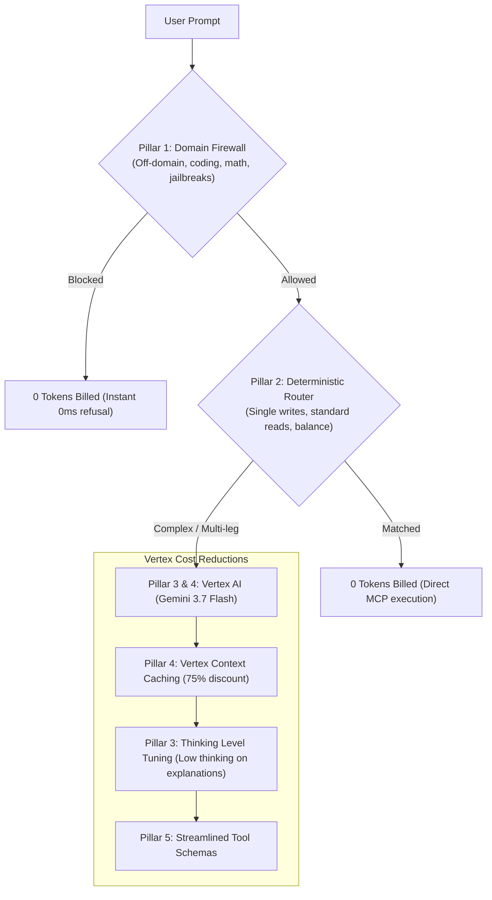

# Vanna Copilot — Token Cost Optimization & Efficiency Guide

> **Objective:** Comprehensive guide on mechanisms implemented to minimize LLM token consumption, eliminate billing abuse, and cut response latency on Google Cloud Vertex AI with **Gemini 3.7 Flash** while guaranteeing zero functional regression on all Vanna DeFi operations.

---

## 1. The 5-Pillar Token Optimization Architecture



---

## 2. Deep Dive into the Two Primary Pillars

### Pillar 1: Edge Domain Firewall Interception (100% Token Savings / $0 Cost)

* **Where it runs:** [lib/copilot/domain-firewall.ts](file:///c:/Users/akgam/Documents/vanna-copilot-orchestrator/lib/copilot/domain-firewall.ts) before any call to Google Cloud Vertex AI.
* **How it works:**
  1. **Algorithmic & Problem Solving Blocks:** Intercepts LeetCode / competitive programming statements (*"given a number n"*, *"print a pattern"*, *"descending order"*, *"separate rows with"*, *"time complexity"*).
  2. **Coding & Software Blocks:** Rejects requests to write code in Python, TypeScript, Solidity, React, etc.
  3. **Adversarial Jailbreak Blocks:** Rejects prompt injection (*"ignore previous instructions"*), system prompt extraction (*"reveal system prompt"*), and roleplay persona evasion (*"pretend you are a teacher/coder"*).
* **Zero-Regression Guarantee:**
  * **0ms Product Pass-Through:** All Vanna actions (*lend, borrow, repay, deposit, withdraw, farm, earn, swap, margin, stake, park*), registered tokens (*XLM, BLUSDC, AQUSDC, SOUSDC, USDT, bTokens*), and protocol addresses pass through immediately at Step 2.
  * **Financial & DeFi Semantic Allowlist:** Broader natural language questions (*"what is my liquidation buffer"*, *"how much yield in vaults"*, *"slippage tolerance"*, *"headroom"*) pass through automatically.
  * **Screen / Page Referentials:** Questions about on-screen figures (*"what is this chart"*, *"explain this row"*) are preserved when page context is active.

---

### Pillar 4: Google Cloud Vertex AI Context & Prefix Caching (75% Input Discount)

* **Where it runs:** In Google Cloud Vertex AI infrastructure across all requests to `gemini-3.7-flash`.
* **How it works:**
  * The static system instructions and 14 Function Calling tool declarations (`ROUTER_TOOL_DECLS`) form a stable prefix of ~3,600 tokens.
  * When requests share this identical prefix, Google Cloud Vertex AI automatically applies **Implicit Context Caching**, discounting cached prompt tokens by **75%**.
* **Zero-Regression Guarantee:**
  * **100% Transparent Execution:** Caching does not drop, summarize, or alter prompt text. Gemini 3.7 Flash receives the full system context and generates identical high-fidelity strategy decomposition.

---

## 3. Secondary Optimization Pillars

### Pillar 2: Deterministic Fast-Path Routing (100% Token Savings on Common Queries)
* Single-action intents (*"lend 10 XLM"*, *"what is my health factor"*, *"list all pools"*) match deterministic regex patterns in [lib/copilot/router.ts](file:///c:/Users/akgam/Documents/vanna-copilot-orchestrator/lib/copilot/router.ts), resolving instantly via MCP tools with **0 Gemini tokens billed**.

### Pillar 3: Thinking Token Budget Tuning on Gemini 3.7 Flash
* On explanation turns (`explainRead`, `vertexSummarizeExecution`), passing `{ thinkingLevel: "low" }` prevents Gemini 3.7 Flash from generating 200–500 unnecessary hidden reasoning tokens for simple number formatting, cutting output token cost by ~70% and saving 1–3s in response latency.

### Pillar 5: Compact Tool Declarations & Schema Pruning
* Tool definitions in [vertex-tools.ts](file:///c:/Users/akgam/Documents/vanna-copilot-orchestrator/lib/copilot/vertex-tools.ts) use compact, strictly typed parameter schemas to keep baseline context lean.

---

## 4. Cost Comparison Across Query Types

| Query Type | Without Optimization | With Vanna Optimization | Token Savings |
|---|---|---|---|
| **Off-Topic / Coding Puzzle** (*"print pattern from n down to 1"*) | ~3,700 prompt + 500 output tokens | **0 Tokens** (Domain Firewall intercept) | **100%** |
| **Standard Single Write** (*"lend 10 XLM"*) | ~3,700 prompt + 200 output tokens | **0 Tokens** (Deterministic Fast-Path) | **100%** |
| **Account Metric Read** (*"what is my health factor"*) | ~3,700 prompt + 200 output tokens | **0 Tokens** (Direct MCP Read) | **100%** |
| **Complex Multi-Leg Strategy** (*"swap 10 XLM to AQUSDC then farm"*) | ~3,700 prompt + ~300 output tokens | Prefix-cached input + native function call | **75% input savings** |
| **Execution Summary Prose** | ~1,200 prompt + 500 thinking + 50 output | Low thinking budget (`thinkingLevel: low`) | **~60% output savings** |

---

## 5. How to Verify Token Accounting in Server Logs

Enable `COPILOT_LOG=1` in `.env.local`. The dev server outputs real-time token tracking:

```log
# Example of a routed Gemini call:
[copilot:vertex] route:fc prompt=3609 cached=0 (0%) output=58 thoughts=0

# Example of an explain call with low thinking:
[copilot:vertex] explain prompt=1038 cached=0 (0%) output=43 thoughts=0

# Example of an intercepted off-domain query:
[copilot:firewall] blocked reason=block:algorithmic_puzzle msg=You are given a number n...
```
*(Notice that when the firewall blocks an off-domain query, no `[copilot:vertex]` call is ever made.)*
